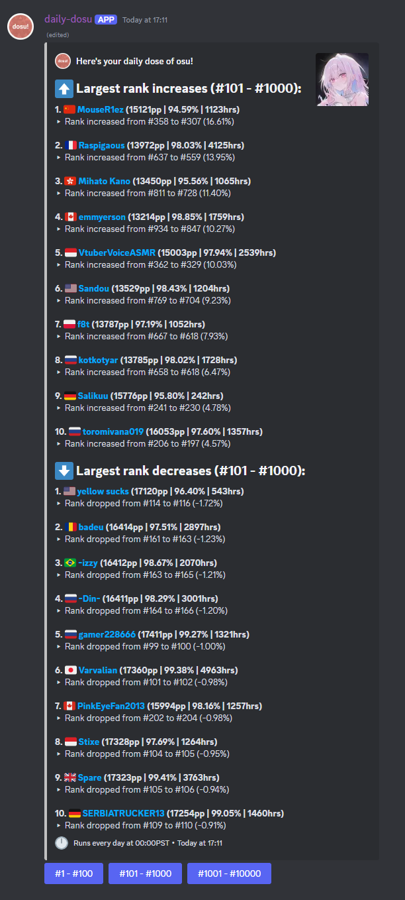

# daily-dosu

A Discord bot that gives you daily [osu!](https://osu.ppy.sh) updates. You can add the bot to your server with [this link](https://discord.com/oauth2/authorize?client_id=1109638103485907094).

## Features

Start your message with a slash (/) to run a command!

- **`newsletter`** - display the daily newsletter.
- **`subscribe`** - begin automatically sending daily newsletters to this channel.
- **`unsubscribe`** - stop sending daily newsletters to this channel.

## Running Locally

I have only tested on Linux. If you try running on other platforms, let me know how it goes!

1. To compile and run, you will need:
    - CMake 3.x
    - `libssl-dev`
    - `zlib1g-dev`
    - `libcurl4-openssl-dev`
2. After cloning the repository, initialize submodules:
    - `git submodule update --init --recursive`
3. Configure the project:
    - `mkdir <build folder path> && cd <build folder path>`
    - `cmake <daily-dosu path> -DCMAKE_BUILD_TYPE=Release`
4. Compile and run the project:
    - `` cmake --build . -j`nproc` ``
    - `./daily-dosu`

First-time users will be guided through a simple setup tool to generate a config file. You will need:
- A registered [osu! OAuth client](https://osu.ppy.sh/home/account/edit)
- A registered [Discord bot](https://discord.com/developers/applications)

## System Configuration
First-time setup will create a default configuration file at `dosu_config.json`. This should be adequate for most users but you may still want to make some tweaks.
- **`LOG_LEVEL`** - how verbose to make logging (0=debug, 1=info, 2=warn, 3=error).
- **`BOT_CONFIG_DB_FILE_PATH`** - where to store the .db file for discord bot state (e.g. subscribed channels).
- **`RANKINGS_DB_FILE_PATH`** - where to store the .db file for the current Rank Increases newsletter.
- **`TOP_PLAYS_DB_FILE_PATH`** - where to store the .db file for the current Top Plays newsletter.
- **`DISCORD_BOT_TOKEN`** - your registered discord bot's token/secret.
- **`OSU_CLIENT_ID`** - your registered osu! client's ID.
- **`OSU_CLIENT_SECRET`** - your registered osu! client's secret.
- **`SCRAPE_RANKINGS_RUN_HOUR`** - what hour of the day (local time) to run the Rank Increases script.
    - NOTE: By default, this is set to 3UTC for a few reasons. Mainly, because this is 1~2 hours before the osu! backend "flips over" to a new day. Changing this value might give you worse results (or better!).
- **`TOP_PLAYS_RUN_HOUR`** - what hour of the day (local time) to run the Rank Increases script.
- **`DISCORD_BOT_STRINGS`** - maps osu! letter ranks (e.g. A, B, C) and mods (e.g. HD, DT, MR) to how they're displayed by the bot. You can use this to display custom emojis for each letter rank / mod by registering them with your discord bot and then copying in the respective markdown string. For example:
    - `"LETTER_RANK_X": "<:letterRank_X:1358102547339935946>"`

## Internals

Core functionality can be found in the following places:
- **`DosuConfig`** - wraps the system configuration (`dosu_config.json`).
- **`DailyJob`** - implements a simple 24-hour job scheduler.
- **`bot/`** - handling for all user-facing discord bot logic.
- **`database/`** - classes for storing persistent data.
- **`http/`** - classes for sending out HTTP requests, e.g. to the osu! API.
- **`job/`** - scripts meant to be run daily.

Daily jobs are registered at the top level (in `main.cpp`). There are currently two jobs - `scrapeRankings` and `getTopPlays`. Let's take `scrapeRankings` for example - we register it as a daily job along with a callback from `Bot`. Each day:
- The scheduler wakes up and runs `scrapeRankings`, which stores its results on disk.
- On completion, `Bot::scrapeRankingsCallback` runs, which loads the results from disk and formats them for Discord.
- Results are sent to any subscribed chat channels.

## Contributing
If you find any bugs or want to request a feature, feel free to open an [issue](https://github.com/mbalsdon/daily-dosu/issues). If you want to make changes, feel free to open a PR. For direct contact, my DMs are open on Discord @spreadnuts.
