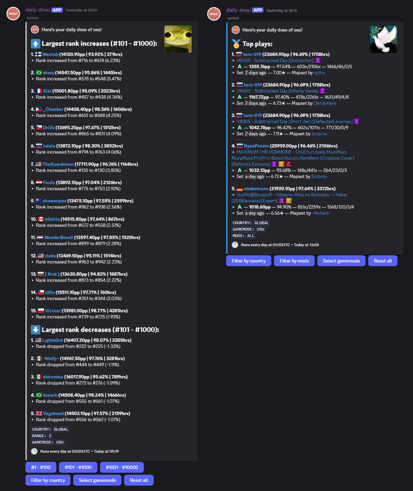

# daily-dosu

A Discord bot for tracking [osu!](https://osu.ppy.sh) leaderboard changes. You can add the bot to your server with [this link](https://discord.com/oauth2/authorize?client_id=1109638103485907094).

## Features

Start your message with a slash (/) to run a command!

- **newsletter** - display the daily newsletter.
- **subscribe** - begin automatically sending daily newsletters to this channel.
- **unsubscribe** - stop sending daily newsletters to this channel.

## Running Locally

I have only tested on Linux. If you try running on other platforms, let me know how it goes!

1. To compile and run, you will need:
    - CMake 3.x
    - `libssl-dev`
    - `zlib1g-dev`
    - `libcurl4-openssl-dev`
2. After cloning the repository, initialize submodules:
    - `git submodule update --init --recursive`
3. Configure the project:
    - `mkdir <build folder path> && cd <build folder path> && cmake <daily-dosu path>`
4. Compile and run the project:
    - `make -j$(($(nproc)+1))`
    - `./daily-dosu`

First-time users will be guided through a simple setup tool to generate a config file. You will need:
- A registered [osu! OAuth client](https://osu.ppy.sh/home/account/edit)
- A registered [Discord bot](https://discord.com/developers/applications)

## Contributing
If you find any bugs or want to request a feature, feel free to open an [issue](https://github.com/mbalsdon/daily-dosu/issues). If you are reporting a bug, try to include as much detail as you can as well as steps on how to reproduce it (if possible). If you are requesting a feature, please describe the feature in as most detail as possible as well as some use-cases for it.

If you want to make changes, feel free to open a PR.

If you want to contact me directly, my DMs are open on Discord @spreadnuts.

## Internals

Core functionality can mainly be found in the following places:
- **ScrapePlayers** - script that fetches user data for the top 10,000 osu! players.
- **DailyJob** - implements a simple 24-hour job scheduler.
- **Bot** - handles all user-facing logic and formatting.

Currently, `ScrapePlayers` is the only "big" job that is undertaken. It is registered along with a callback from `Bot` as a `DailyJob`, thus the flow of execution is roughly:
- Scheduler wakes up and runs `scrapePlayers`, which stores its results on disk in a JSON file.
- On completion, `scrapePlayersCallback` runs, which loads the results from disk and formats them for Discord.
- Results are sent to any subscribed chat channels (also held in JSON format on disk - logic can be found in `ServerConfig`).

The data stored is not currently complex or large enough to warrant something like SQLite, but of course it may be necessary to move there in the future.
